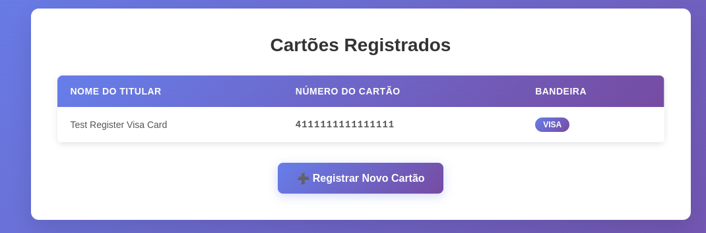

# 💳 Credit Card Management System

Complete credit card management system developed with **Spring Boot**, offering both a web interface with **Thymeleaf** and a **REST API** with OpenAPI/Swagger documentation.

## 📋 Table of Contents

- [About the Project](#about-the-project)
- [Technologies Used](#technologies-used)
- [Architecture](#architecture)
- [Features](#features)
- [Prerequisites](#prerequisites)
- [Installation and Execution](#installation-and-execution)
- [Thymeleaf Integration](#thymeleaf-integration)
- [REST API](#rest-api)
- [OpenAPI## 👨‍💻 Author

Developed by **Reinaldo Jesus Santana**

- LinkedIn: https://www.linkedin.com/in/reinaldo-jesus-santana-09079814/


⭐ If this project was useful to you, consider giving it a star!

**Developed with ❤️ using Spring Boot and Thymeleaf**ion](#openapiswagger-documentation)
- [Project Structure](#project-structure)
- [Design Patterns](#design-patterns)
- [Usage Examples](#usage-examples)

## 🎯 About the Project

This project demonstrates a complete Spring Boot application that implements a credit card management system with:

- **Web Interface (Thymeleaf)**: Interactive forms for card registration and listing
- **REST API**: JSON endpoints for integration with other systems
- **Brand Validation**: Support for Visa, MasterCard, and American Express
- **Strategy Pattern**: Brand-specific validation for each card type
- **Automatic Documentation**: Swagger UI to explore and test the API

## 🚀 Technologies Used

| Technology | Version | Description |
|------------|---------|-------------|
| **Java** | 21 | Programming language |
| **Spring Boot** | 4.0.0 | Main framework |
| **Spring Web** | - | For creating web and REST controllers |
| **Spring Thymeleaf** | - | Template engine for HTML pages |
| **Spring Validation** | - | Data validation with Bean Validation |
| **SpringDoc OpenAPI** | 3.0.0 | Automatic API documentation generation |
| **Maven** | - | Dependency manager |

## 🏗️ Architecture

The project follows a layered architecture:

```
┌─────────────────────────────────────┐
│     Presentation Layer              │
│  (Web Controllers + REST API)       │
├─────────────────────────────────────┤
│     Service Layer                   │
│  (Business Logic)                   │
├─────────────────────────────────────┤
│     Domain Layer                    │
│  (Entities + Strategy Pattern)      │
├─────────────────────────────────────┤
│     Configuration Layer             │
│  (OpenAPI, Exception Handlers)      │
└─────────────────────────────────────┘
```

### Main Components

- **Controllers**: Manage HTTP requests (Web and API)
- **Services**: Contain business logic
- **Domain**: Domain models and validation strategies
- **Exception Handlers**: Centralized error handling

## ✨ Features

### Web Interface (Thymeleaf)

- ✅ Card registration form with validation
- ✅ Brand selection (Visa, MasterCard, Amex)
- ✅ Registered cards listing
- ✅ Responsive and modern design
- ✅ User-friendly error messages

### REST API

- ✅ Endpoint to list all cards (`GET /api/cards`)
- ✅ Endpoint to register new card (`POST /api/cards`)
- ✅ Automatic validation with Bean Validation
- ✅ JSON format responses
- ✅ Standardized error handling

### Brand Validation

- ✅ **Visa**: Starts with 4, 16 digits
- ✅ **MasterCard**: Starts with 5, 16 digits
- ✅ **American Express**: Starts with 3, 15 digits

## 📦 Prerequisites

Before starting, make sure you have installed:

- **Java JDK 21** or higher
- **Maven 3.6+**
- **Git** (optional, to clone the repository)

## 🔧 Installation and Execution

### 1. Clone the repository (or navigate to the project directory)

```bash
cd /home/rsantana/projetos/spring-boot/cartoes/credit-card-app
```

### 2. Compile the project

```bash
mvn clean install
```

### 3. Run the application

```bash
mvn spring-boot:run
```

Or run the generated JAR:

```bash
java -jar target/credit-card-thymeleaf-0.0.1-SNAPSHOT.jar
```

### 4. Access the application

The application will be available at: **http://localhost:8080**

## 🎨 Thymeleaf Integration

### How It Works

Thymeleaf is integrated through the `spring-boot-starter-thymeleaf` dependency and provides:

1. **HTML Templates**: Located in `src/main/resources/templates/`
2. **Web Controller**: `CreditCardController` renders the views
3. **Model Binding**: Data is passed from controller to view via `Model`
4. **Form Binding**: HTML forms are bound to Java objects

### Web Endpoints

| Route | Method | Description | Template |
|-------|--------|-------------|----------|
| `/cards/new` | GET | Displays registration form | `register.html` |
| `/cards` | POST | Processes card registration | - |
| `/cards/list` | GET | Lists all cards | `list.html` |

### Template Example (register.html)

```html
<form th:action="@{/cards}" th:object="${cardForm}" method="post">
    <div class="form-group">
        <label for="holderName">Cardholder Name</label>
        <input type="text" th:field="*{holderName}" />
        <span th:if="${#fields.hasErrors('holderName')}" 
              th:errors="*{holderName}" 
              class="error"></span>
    </div>
    <!-- More fields... -->
</form>
```

### Validation in Thymeleaf

Validation is done through:
- **@Valid** in the controller
- **BindingResult** to capture errors
- **th:errors** to display messages

```java
@PostMapping
public String registerCard(@Valid @ModelAttribute("cardForm") CreditCardForm form,
                          BindingResult bindingResult,
                          Model model) {
    if (bindingResult.hasErrors()) {
        return "register";
    }
    // Process...
}
```

## 🔌 REST API

### Available Endpoints

#### 1. List All Cards

```http
GET /api/cards
Accept: application/json
```

**Response (200 OK):**
```json
[
    {
        "holderName": "John Doe",
        "number": "4111111111111111",
        "brand": "VISA"
    },
    {
        "holderName": "Jane Smith",
        "number": "5500000000000004",
        "brand": "MASTERCARD"
    }
]
```

#### 2. Register New Card

```http
POST /api/cards
Content-Type: application/json
Accept: application/json
```

**Request Body:**
```json
{
    "holderName": "Bob Johnson",
    "number": "4111111111111111",
    "brand": "VISA"
}
```

**Response (201 Created):**
```json
{
    "holderName": "Bob Johnson",
    "number": "4111111111111111",
    "brand": "VISA"
}
```

**Error Response (400 Bad Request):**
```json
{
    "timestamp": "2025-11-22T10:30:00",
    "status": 400,
    "error": "Bad Request",
    "message": "Visa: number must start with 4",
    "path": "/api/cards"
}
```

### Error Handling

The `GlobalExceptionHandler` automatically catches and handles:

- **MethodArgumentNotValidException**: Validation errors (@Valid)
- **IllegalArgumentException**: Business rule errors
- **CreditCardNotFoundException**: Card not found
- **Exception**: General errors

All error responses follow the standard:

```json
{
    "timestamp": "ISO-8601 DateTime",
    "status": 400,
    "error": "Error Type",
    "message": "Descriptive message",
    "path": "/endpoint/path"
}
```

## 📚 OpenAPI/Swagger Documentation

### Accessing the Documentation

Interactive documentation is available at:

- **Swagger UI**: http://localhost:8080/swagger-ui.html
- **OpenAPI JSON**: http://localhost:8080/v3/api-docs

### Configuration

The OpenAPI configuration is in `OpenApiConfig.java`:

```java
@Configuration
public class OpenApiConfig {
    @Bean
    public OpenAPI customOpenAPI() {
        return new OpenAPI()
            .info(new Info()
                .title("Credit Cards API")
                .description("REST API for credit card management")
                .version("1.0.0"))
            .addServersItem(new Server()
                .url("http://localhost:8080")
                .description("Development Server"));
    }
}
```

### Annotations Used

- **@Tag**: Groups endpoints by category
- **@Operation**: Describes the operation
- **@ApiResponses**: Defines possible HTTP responses

```java
@Tag(name = "Credit Cards API", description = "REST API for credit card management")
@RestController
@RequestMapping("/api/cards")
public class CreditCardApiController {
    
    @Operation(summary = "List all cards")
    @ApiResponses({
        @ApiResponse(responseCode = "200", description = "List returned successfully"),
        @ApiResponse(responseCode = "500", description = "Internal error")
    })
    @GetMapping
    public List<CreditCard> getAllCards() { ... }
}
```

## 📁 Project Structure

```
src/
├── main/
│   ├── java/com/example/cards/
│   │   ├── CardsApplication.java              # Main class
│   │   ├── config/
│   │   │   └── OpenApiConfig.java             # Swagger configuration
│   │   ├── domain/
│   │   │   ├── CreditCard.java                # Card interface
│   │   │   ├── DefaultCreditCard.java         # Default implementation
│   │   │   ├── CreditCardBrand.java           # Brand enum
│   │   │   ├── CreditCardBrandStrategy.java   # Strategy interface
│   │   │   ├── CreditCardBrandFactory.java    # Strategy factory
│   │   │   ├── CreditCardBrandStrategyProvider.java
│   │   │   ├── visa/
│   │   │   │   └── VisaStrategy.java          # Visa validation
│   │   │   ├── master/
│   │   │   │   └── MasterCardStrategy.java    # MasterCard validation
│   │   │   └── amex/
│   │   │       └── AmexStrategy.java          # Amex validation
│   │   ├── exception/
│   │   │   ├── GlobalExceptionHandler.java    # Global error handling
│   │   │   ├── ErrorResponse.java             # Error DTO
│   │   │   └── CreditCardNotFoundException.java
│   │   ├── service/
│   │   │   └── CreditCardRegistrationService.java  # Business logic
│   │   └── web/
│   │       ├── CreditCardController.java      # Thymeleaf controller
│   │       ├── CreditCardApiController.java   # REST controller
│   │       ├── CreditCardForm.java            # Form DTO
│   │       └── CreditCardApiRequest.java      # API Request DTO
│   └── resources/
│       ├── application.properties             # Configuration
│       └── templates/
│           ├── register.html                  # Registration form
│           └── list.html                      # Card listing
└── test/
    └── java/...
```

## 🎯 Design Patterns

### 1. Strategy Pattern

Implemented for card brand validation:

```java
public interface CreditCardBrandStrategy {
    void validate(String number);
    String normalize(String number);
    double calculateFee(double amount);
}

// Specific implementations
class VisaStrategy implements CreditCardBrandStrategy { ... }
class MasterCardStrategy implements CreditCardBrandStrategy { ... }
class AmexStrategy implements CreditCardBrandStrategy { ... }
```

**Benefits:**
- Facilitates adding new brands
- Separates validation logic by brand
- Cleaner and more maintainable code

### 2. Factory Pattern

`CreditCardBrandFactory` creates strategy instances:

```java
public class CreditCardBrandFactory {
    public static CreditCardBrandStrategy getStrategy(CreditCardBrand brand) {
        return switch(brand) {
            case VISA -> new VisaStrategy();
            case MASTERCARD -> new MasterCardStrategy();
            case AMEX -> new AmexStrategy();
        };
    }
}
```

### 3. DTO Pattern

Separation between domain entities and transfer objects:

- **CreditCardForm**: For web forms
- **CreditCardApiRequest**: For API requests
- **ErrorResponse**: For error responses

## 💡 Usage Examples

### Example 1: Test via Swagger UI

1. Access: http://localhost:8080/swagger-ui.html
2. Expand the `POST /api/cards` endpoint
3. Click "Try it out"
4. Insert the JSON:
```json
{
    "holderName": "John Doe",
    "number": "4111111111111111",
    "brand": "VISA"
}
```
5. Click "Execute"

### Example 2: Test via cURL

```bash
# List cards
curl -X GET http://localhost:8080/api/cards

# Register Visa card
curl -X POST http://localhost:8080/api/cards \
  -H "Content-Type: application/json" \
  -d '{
    "holderName": "John Doe",
    "number": "4111111111111111",
    "brand": "VISA"
  }'

# Register MasterCard
curl -X POST http://localhost:8080/api/cards \
  -H "Content-Type: application/json" \
  -d '{
    "holderName": "Jane Smith",
    "number": "5500000000000004",
    "brand": "MASTERCARD"
  }'

# Register Amex card
curl -X POST http://localhost:8080/api/cards \
  -H "Content-Type: application/json" \
  -d '{
    "holderName": "Bob Johnson",
    "number": "340000000000009",
    "brand": "AMEX"
  }'
```

### Example 3: Use Web Interface

1. Access: http://localhost:8080/cards/new
2. Fill out the form:
   - Cardholder Name: John Doe
   - Card Number: 4111111111111111
   - Brand: VISA
3. Click "Register Card"
4. You will be redirected to the card list

### Example 4: Validation Test

Trying to register an invalid card:

```bash
curl -X POST http://localhost:8080/api/cards \
  -H "Content-Type: application/json" \
  -d '{
    "holderName": "Test",
    "number": "1234567890123456",
    "brand": "VISA"
  }'
```

Expected response (400 Bad Request):
```json
{
    "timestamp": "2025-11-22T10:30:00",
    "status": 400,
    "error": "Bad Request",
    "message": "Visa: number must start with 4",
    "path": "/api/cards"
}
```




## 🔒 Security and Best Practices

- ✅ Input validation with Bean Validation
- ✅ Centralized exception handling
- ✅ Layer separation (MVC)
- ✅ Interface usage for decoupling
- ✅ Design patterns for flexibility
- ⚠️ **Note**: This is a demonstration project. For production, consider:
  - Adding authentication/authorization (Spring Security)
  - Implementing real persistence (JPA/Hibernate)
  - Adding unit and integration tests
  - Implementing HTTPS
  - Masking card numbers in logs

## 📝 Configuration

### application.properties

```properties
# Server port
server.port=8080

# Thymeleaf (disable cache in dev)
spring.thymeleaf.cache=false

# SpringDoc OpenAPI
# springdoc.api-docs.path=/v3/api-docs
# springdoc.swagger-ui.path=/swagger-ui.html
# springdoc.swagger-ui.operationsSorter=method
# springdoc.swagger-ui.tagsSorter=alpha
```

## 🚧 Future Improvements

- [ ] Database persistence (PostgreSQL/MySQL)
- [ ] Implement Luhn algorithm for complete validation
- [ ] Add JWT authentication
- [ ] Create unit and integration tests
- [ ] Implement pagination in listing
- [ ] Add search and filters
- [ ] Create statistics dashboard
- [ ] Implement soft delete
- [ ] Add operation auditing
- [ ] Dockerize the application

## 🤝 Contributing

Contributions are welcome! To contribute:

1. Fork the project
2. Create a branch for your feature (`git checkout -b feature/MyFeature`)
3. Commit your changes (`git commit -m 'Add MyFeature'`)
4. Push to the branch (`git push origin feature/MyFeature`)
5. Open a Pull Request

## 📄 License

This project is licensed under the MIT License.

## 👨‍💻 Author

Developed by **Reinaldo Jesus Santana**

- linkdIn: https://www.linkedin.com/in/reinaldo-jesus-santana-09079814/

